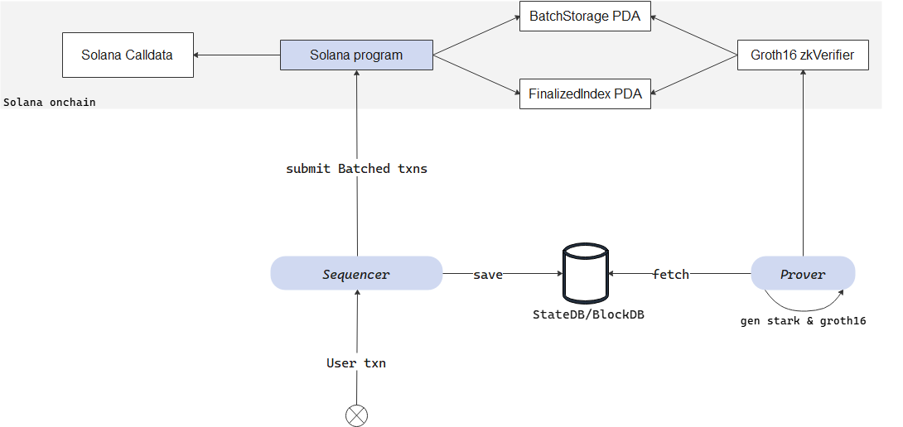

# `solana-zk-layer2`

A mini Solana layer2 (network extension) that proves state transitions by verifying Groth16 proofs, leveraging Solana’s BN254 precompiles for efficient cryptographic operations.

## Motivation
Solana's BN254 precompiles bring the potential for execution layer scalability. This project aims to explore innovations in Solana's network extensions.
[`SIMD-0302: BN254 G2 Arithmetic Syscalls`](https://github.com/solana-foundation/solana-improvement-documents/blob/main/proposals/XXXX-bn254-g2-syscalls.md)

## Project component arch


## Build & Run
#### Step1. solana-program (Onchain app)
```bash
# Build SVM bpf
cd solana-program && anchor build

# Run a local solana node
solana-test-validator

# Deploy
anchor deploy

# Test
cd ../client && cargo run
```

#### Step2. sequencer
```bash
# Deploy
cd sequencer && cargo run
# The program will output the following log:
# 25-07-30T09:22:43Z INFO  sequencer] Starting solana layer2 sequencer...
# [2025-07-30T09:22:43Z INFO  sequencer::rpc] Starting node rpc server on 0.0.0.0:8898
# [2025-07-30T09:22:45Z INFO  sequencer::node] Generated block #1 with 0 transactions
# [2025-07-30T09:22:47Z INFO  sequencer::node] Generated block #2 with 0 transactions
```

#### Step3. prover
```bash
cd prover/host && cargo run
# Proof generation and compression and groth16 conversion require a lot of memory 
# and high computer performance. It is recommended to use succinct-prove-network.
```

## Pending features
Support more SVM built-in instructions (but not all) beyond just transfer ins. Explore adding custom instructions/precompilers to explore innovations in the Solana execution layer. Next up is Solana and EVM wallet support.

## Additional Notes
This project using [`groth16-solana`](https://github.com/Lightprotocol/groth16-solana/) from Light Protocol Labs for the on-chain verification, [`sp1-solana`](https://github.com/succinctlabs/sp1-solana/) for proof generation, and the [`ark-bn254`](https://github.com/arkworks-rs/algebra) for the curve math . Couldn't have done it without them!